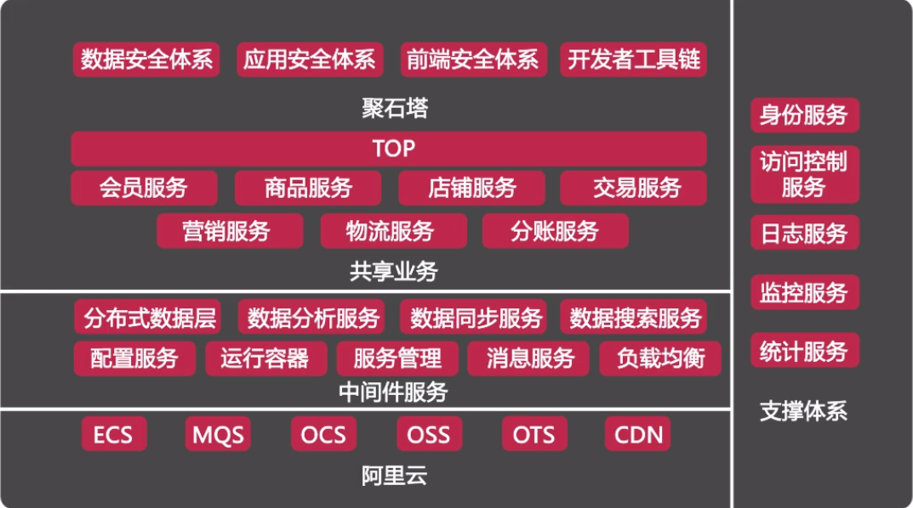

## mall商城
淘宝服务端项目架构

* 为什么做单点登陆
* 有哪些解决方案，各有什么优缺点
* 为什么选择这种解决方案
* 在选择这种解决方案时，是如何取舍的?
#### 环境搭建
#### 数据库及接口
#### 项目初始化
#### 用户模块
#### 分类模块
#### 商品模块
#### 购物车模块
#### 收获地址模块
#### 支付模块
#### 订单模块
#### 云服务器发布
#### 总结和展望